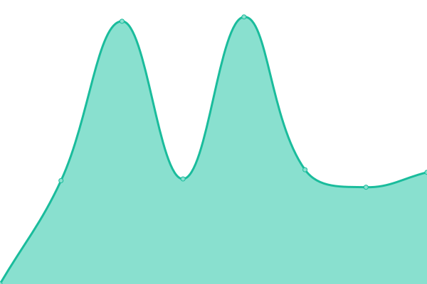
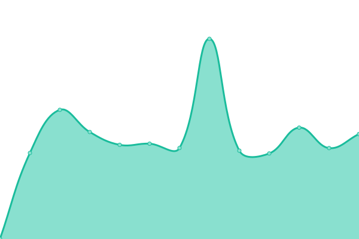
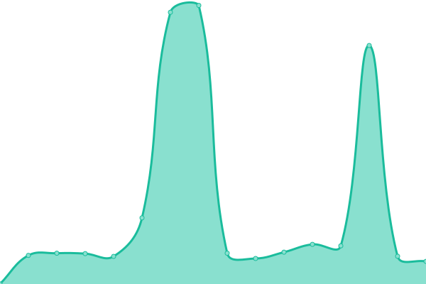
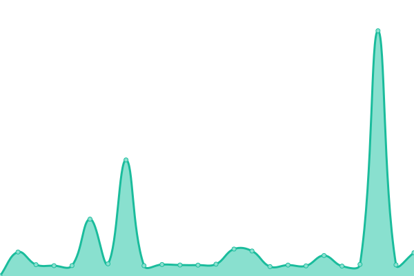

# [📈 实时状态](https://tomb003.github.io/upptime): <！ -实时状态- > **所有系统都可以正常运行**

This repository contains the open-source uptime monitor and status page for [tomb003](https://tomb003.github.io/upptime), powered by [Upptime](https://github.com/upptime/upptime).

With [Upptime](https://upptime.js.org), you can get your own unlimited and free uptime monitor and status page, powered entirely by a GitHub repository. We use [Issues](https://github.com/tomb003/upptime/issues) as incident reports, [Actions](https://github.com/tomb003/upptime/actions) as uptime monitors, and [Pages](https://tomb003.github.io/upptime) for the status page.

## [📈 Live Status](https://demo.upptime.js.org): <!--live status--> **所有系统都可以正常运行**

<!--start: status pages-->
<!-- This summary is generated by Upptime (https://github.com/upptime/upptime) -->
<!-- Do not edit this manually, your changes will be overwritten -->
<!-- prettier-ignore -->
| 链接 | 状态 | 历史 | 响应时间 | 正常运行时间 |
| --- | ------ | ------- | ------------- | ------ |
|  rtl | 🟩 正常运行 | [rtl.yml](https://github.com/tomb003/upptime/commits/HEAD/history/rtl.yml) | 

 3574毫秒
     
 | 

<a href="https://tomb003.github.io/upptime/history/rtl">97.40%</a>
    

|  rtx | 🟩 正常运行 | [rtx.yml](https://github.com/tomb003/upptime/commits/HEAD/history/rtx.yml) | 

 1707毫秒
     
 | 

<a href="https://tomb003.github.io/upptime/history/rtx">91.98%</a>
    

|  r3x | 🟩 正常运行 | [r3x.yml](https://github.com/tomb003/upptime/commits/HEAD/history/r3x.yml) | 

 1158毫秒
     
 | 

<a href="https://tomb003.github.io/upptime/history/r3x">91.30%</a>
    

|  rcx | 🟩 正常运行 | [rcx.yml](https://github.com/tomb003/upptime/commits/HEAD/history/rcx.yml) | 

 1014毫秒
     
 | 

<a href="https://tomb003.github.io/upptime/history/rcx">92.96%</a>
    

|  rtu | 🟩 正常运行 | [rtu.yml](https://github.com/tomb003/upptime/commits/HEAD/history/rtu.yml) | 

 3000毫秒
     
 | 

<a href="https://tomb003.github.io/upptime/history/rtu">99.67%</a>
    

|  ruk | 🟩 正常运行 | [ruk.yml](https://github.com/tomb003/upptime/commits/HEAD/history/ruk.yml) | 

 678毫秒
     
 | 

<a href="https://tomb003.github.io/upptime/history/ruk">100.00%</a>
    

<!--end: status pages-->

[**Visit our status website →**](https://tomb003.github.io/upptime)

## 📄 License

- Powered by: [Upptime](https://github.com/upptime/upptime)
- Code: [MIT](./LICENSE) © [tomb003](https://tomb003.github.io/upptime)
- Data in the `./history` directory: [Open Database License](https://opendatacommons.org/licenses/odbl/1-0/)
